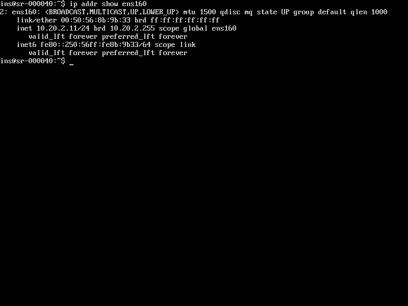
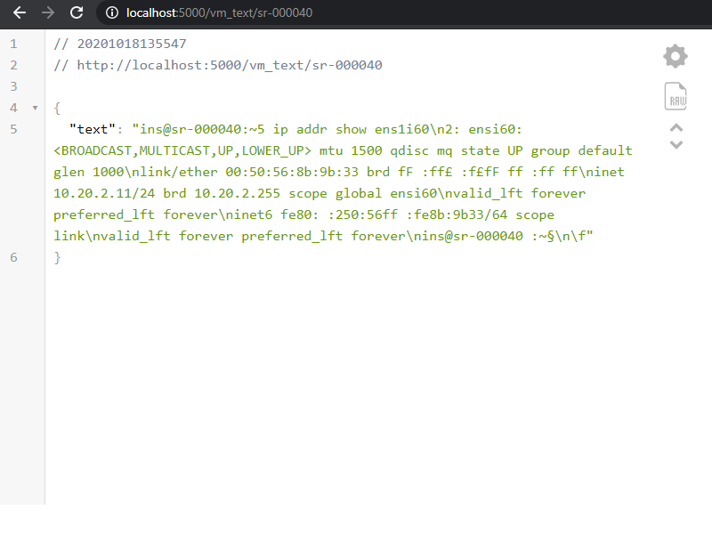
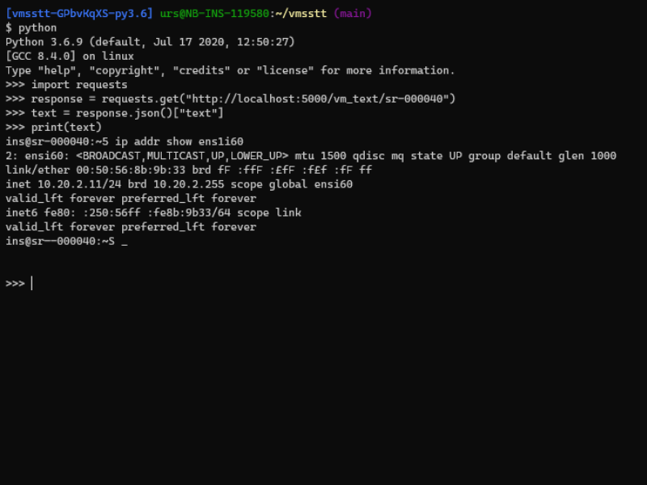

# VMSSTT (Virtual Machine ScreenShot to Text)

Small flask app

This flask app provides a sime endpoint to get the text from a VM running on vShpere. `http://<server>:5000/vm_text/<VM_NAME>`
Under the hood the app connects to the vCenter, searches for the VM and greates a screenshot. 
After the screenshot is done, the screen shot will be downloaded into the memmory and deleted on the datastore.
Tesseract-ocr is as an OCR tool to get to the text. For a better result, the screenshot is manipulated in an extremely basic way.

**This is a PoC and no big effort is put into this (yet)**

Example VM console screen


Response in browser (with json plugin)


Printing the text with python


## Docker deployment

Copy `vmsstt.env.tmpl` to `vmsstt.env` and edit the settings.

```bash
cp vmsstt.env.tmpl vmsstt.env
```

Run docker with your prefered settings. For example like this:

```bash
docker run -it --rm --env-file vmsstt.env -p 5000:5000 vmsstt
```

Build docker image manually

```bash
docker build -t vmsstt .
```

## Setup without docker

This repo uses poetry and **tesseract-ocr**

### Install requirements

```bash
apt-get install tesseract-ocr
poetry install
```

### Open shell with venv and run app

```bash
poetry shell
```

### Run app (first open shell)

```bash
python flask_app.py
```

### Format python document (first open shell)

```bash
black flask_app.py
```
